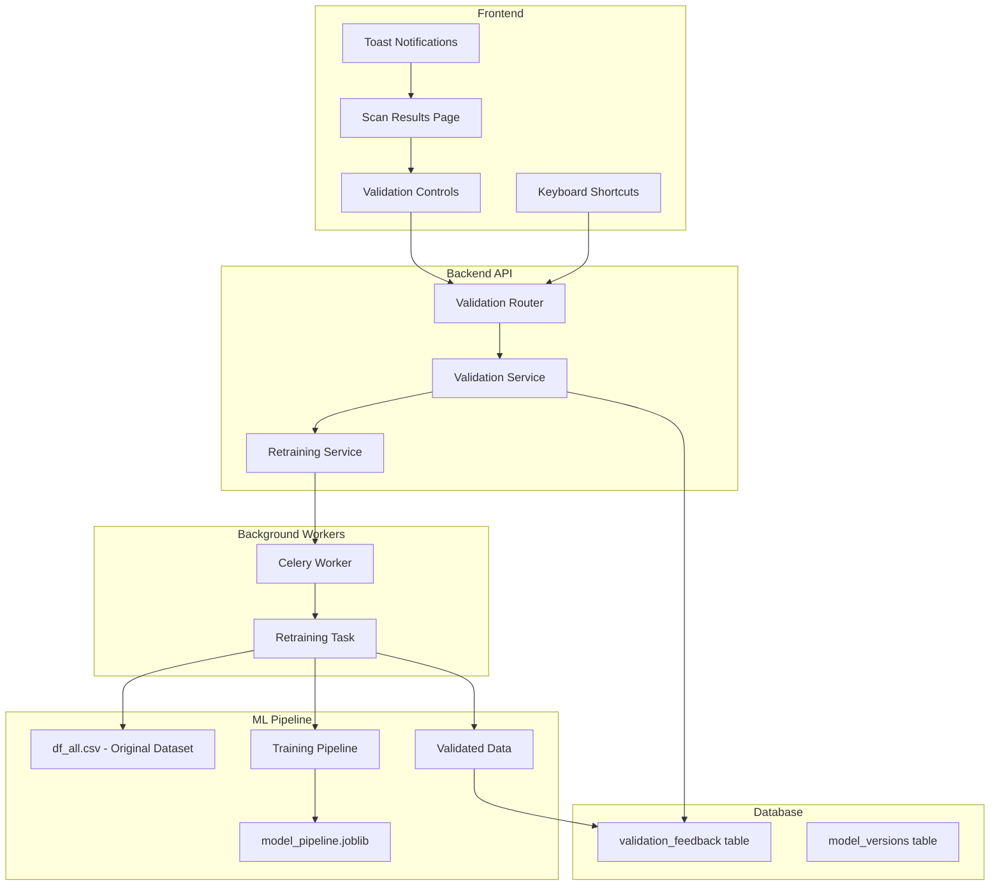

# Design Document: Auto ML Retraining

## Overview

Fitur Auto ML Retraining memungkinkan sistem untuk meningkatkan akurasi model deteksi komentar gambling secara berkelanjutan melalui feedback validasi pengguna. Sistem mengumpulkan koreksi dari pengguna, menyimpannya sebagai training data tambahan, dan secara otomatis melatih ulang model ketika threshold tercapai.

Arsitektur dirancang dengan prinsip:
- **Non-intrusive UX**: Validasi terintegrasi seamless ke workflow existing
- **Async Processing**: Retraining berjalan di background tanpa mengganggu service
- **Model Versioning**: Rollback capability jika model baru underperform
- **Incremental Learning**: Data validasi dikombinasikan dengan dataset original

## Architecture



## Components and Interfaces


### Backend Components

#### 1. ValidationFeedback Model (SQLAlchemy)
```python
class ValidationFeedback(Base):
    __tablename__ = "validation_feedback"
    
    id: UUID (PK)
    scan_result_id: UUID (FK -> scan_results.id)
    user_id: UUID (FK -> users.id)
    comment_text: Text
    original_prediction: Boolean  # Model's original prediction
    original_confidence: Float
    corrected_label: Boolean  # User's correction (True=gambling, False=clean)
    is_correction: Boolean  # True if user disagreed with model
    validated_at: DateTime
    used_in_training: Boolean  # Flag if used in retraining
    model_version_id: UUID (FK, nullable)  # Which model version used this data
```

#### 2. ModelVersion Model (SQLAlchemy)
```python
class ModelVersion(Base):
    __tablename__ = "model_versions"
    
    id: UUID (PK)
    version: String  # e.g., "v1.0.0", "v1.1.0"
    file_path: String  # Path to model file
    training_samples: Integer  # Total samples used
    validation_samples: Integer  # New validation samples added
    accuracy: Float (nullable)  # Accuracy on test set
    is_active: Boolean  # Currently serving predictions
    created_at: DateTime
    activated_at: DateTime (nullable)
    deactivated_at: DateTime (nullable)
```

#### 3. Validation Service
```python
class ValidationService:
    async def submit_validation(
        self, 
        scan_result_id: UUID, 
        user_id: UUID, 
        is_correct: bool,
        corrected_label: bool | None = None
    ) -> ValidationFeedback
    
    async def batch_validate(
        self,
        validations: list[ValidationInput],
        user_id: UUID
    ) -> BatchValidationResult
    
    async def undo_validation(
        self,
        validation_id: UUID,
        user_id: UUID
    ) -> bool
    
    async def get_validation_stats(
        self,
        user_id: UUID | None = None
    ) -> ValidationStats
    
    async def check_retraining_threshold(self) -> bool
```

#### 4. Retraining Service
```python
class RetrainingService:
    MODEL_PARAMS = {
        'classifier__C': 10,
        'classifier__solver': 'lbfgs',
        'vectorizer__char_tfidf__ngram_range': (2, 4),
        'vectorizer__word_tfidf__ngram_range': (1, 2)
    }
    
    async def trigger_retraining(self) -> str  # Returns task_id
    
    async def get_training_data(self) -> pd.DataFrame
    # Combines df_all.csv with validation_feedback
    
    def build_pipeline(self) -> Pipeline
    # Creates hybrid_all_features + LogisticRegression pipeline
    
    async def train_and_evaluate(self, data: pd.DataFrame) -> ModelMetrics
    
    async def deploy_model(self, model_path: Path, version: str) -> bool
    
    async def rollback_model(self, version_id: UUID) -> bool
```

### Frontend Components

#### 1. ValidationToggle Component
```typescript
interface ValidationToggleProps {
  resultId: string;
  isGambling: boolean;
  confidence: number;
  onValidate: (isCorrect: boolean, correctedLabel?: boolean) => void;
  isValidated?: boolean;
  validationState?: 'confirmed' | 'corrected';
}
```

#### 2. BatchValidationModal Component
```typescript
interface BatchValidationModalProps {
  selectedResults: ScanResultResponse[];
  onConfirm: (action: 'confirm_all' | 'mark_gambling' | 'mark_clean') => void;
  onClose: () => void;
  isOpen: boolean;
}
```

#### 3. ValidationProgressBar Component
```typescript
interface ValidationProgressProps {
  totalComments: number;
  validatedCount: number;
  correctionsCount: number;
  thresholdProgress: number;  // Progress toward retraining threshold
}
```

#### 4. useValidation Hook
```typescript
interface UseValidationReturn {
  submitValidation: (resultId: string, isCorrect: boolean, correctedLabel?: boolean) => Promise<void>;
  batchValidate: (resultIds: string[], action: BatchAction) => Promise<void>;
  undoValidation: (validationId: string) => Promise<void>;
  validationStats: ValidationStats;
  isLoading: boolean;
  recentValidation: ValidationFeedback | null;  // For undo toast
}
```

### API Endpoints

#### Validation Endpoints
```
POST   /api/validation/submit          - Submit single validation
POST   /api/validation/batch           - Submit batch validation
DELETE /api/validation/{id}            - Undo validation (within time window)
GET    /api/validation/stats           - Get validation statistics
GET    /api/validation/progress        - Get progress toward retraining
```

#### Model Management Endpoints (Admin)
```
GET    /api/model/versions             - List model versions
GET    /api/model/current              - Get current active model info
POST   /api/model/retrain              - Manually trigger retraining
POST   /api/model/rollback/{version}   - Rollback to previous version
GET    /api/model/metrics              - Get model performance metrics
```

## Data Models

### Database Schema

```sql
-- Validation feedback table
CREATE TABLE validation_feedback (
    id UUID PRIMARY KEY DEFAULT gen_random_uuid(),
    scan_result_id UUID NOT NULL REFERENCES scan_results(id) ON DELETE CASCADE,
    user_id UUID NOT NULL REFERENCES users(id) ON DELETE CASCADE,
    comment_text TEXT NOT NULL,
    original_prediction BOOLEAN NOT NULL,
    original_confidence FLOAT NOT NULL,
    corrected_label BOOLEAN NOT NULL,
    is_correction BOOLEAN NOT NULL,
    validated_at TIMESTAMP WITH TIME ZONE DEFAULT NOW(),
    used_in_training BOOLEAN DEFAULT FALSE,
    model_version_id UUID REFERENCES model_versions(id),
    
    UNIQUE(scan_result_id, user_id)  -- One validation per user per result
);

CREATE INDEX ix_validation_feedback_user ON validation_feedback(user_id);
CREATE INDEX ix_validation_feedback_used ON validation_feedback(used_in_training);
CREATE INDEX ix_validation_feedback_correction ON validation_feedback(is_correction);

-- Model versions table
CREATE TABLE model_versions (
    id UUID PRIMARY KEY DEFAULT gen_random_uuid(),
    version VARCHAR(50) NOT NULL UNIQUE,
    file_path VARCHAR(500) NOT NULL,
    training_samples INTEGER NOT NULL,
    validation_samples INTEGER DEFAULT 0,
    accuracy FLOAT,
    precision_score FLOAT,
    recall_score FLOAT,
    f1_score FLOAT,
    is_active BOOLEAN DEFAULT FALSE,
    created_at TIMESTAMP WITH TIME ZONE DEFAULT NOW(),
    activated_at TIMESTAMP WITH TIME ZONE,
    deactivated_at TIMESTAMP WITH TIME ZONE
);

CREATE INDEX ix_model_versions_active ON model_versions(is_active);
```

### Pydantic Schemas

```python
# Validation schemas
class ValidationSubmit(BaseModel):
    scan_result_id: UUID
    is_correct: bool
    corrected_label: bool | None = None  # Required if is_correct=False

class BatchValidationSubmit(BaseModel):
    result_ids: list[UUID]
    action: Literal['confirm_all', 'mark_gambling', 'mark_clean']

class ValidationResponse(BaseModel):
    id: UUID
    scan_result_id: UUID
    is_correction: bool
    corrected_label: bool
    validated_at: datetime
    can_undo: bool  # True if within undo window

class ValidationStats(BaseModel):
    total_validated: int
    corrections_made: int
    pending_for_training: int
    threshold: int
    progress_percent: float

# Model schemas
class ModelVersionResponse(BaseModel):
    id: UUID
    version: str
    accuracy: float | None
    is_active: bool
    created_at: datetime
    training_samples: int
    validation_samples: int
```

## ML Pipeline Configuration

### Training Pipeline Structure
```python
from sklearn.pipeline import Pipeline, FeatureUnion
from sklearn.feature_extraction.text import TfidfVectorizer
from sklearn.linear_model import LogisticRegression
from app.ml.preprocessor import TextPreprocessor

def build_training_pipeline():
    """Build hybrid_all_features + LogisticRegression pipeline."""
    
    # Hybrid vectorizer combining word and char n-grams
    vectorizer = FeatureUnion([
        ('word_tfidf', TfidfVectorizer(
            ngram_range=(1, 2),
            analyzer='word',
            max_features=10000
        )),
        ('char_tfidf', TfidfVectorizer(
            ngram_range=(2, 4),
            analyzer='char',
            max_features=10000
        ))
    ])
    
    pipeline = Pipeline([
        ('preprocessor', TextPreprocessor()),
        ('vectorizer', vectorizer),
        ('classifier', LogisticRegression(
            C=10,
            solver='lbfgs',
            max_iter=1000,
            random_state=42
        ))
    ])
    
    return pipeline
```

### Retraining Configuration
```python
RETRAINING_CONFIG = {
    'threshold': 100,  # Minimum validations before retraining
    'test_size': 0.2,  # Hold out for evaluation
    'min_accuracy_improvement': 0.0,  # Deploy if accuracy >= previous
    'model_dir': 'backend/ml/models/',
    'original_dataset': 'backend/ml/df_all.csv',
    'hyperparameters': {
        'classifier__C': 10,
        'classifier__solver': 'lbfgs',
        'vectorizer__word_tfidf__ngram_range': (1, 2),
        'vectorizer__char_tfidf__ngram_range': (2, 4),
    }
}
```


## Correctness Properties

*A property is a characteristic or behavior that should hold true across all valid executions of a system-essentially, a formal statement about what the system should do. Properties serve as the bridge between human-readable specifications and machine-verifiable correctness guarantees.*

### Property 1: Validation State Consistency
*For any* scan result and validation action, when a user submits a validation (confirm or correct), the validation state should accurately reflect the user's input and the UI should update to show the correct state (confirmed/corrected).
**Validates: Requirements 1.1, 1.2**

### Property 2: Low Confidence Highlighting
*For any* scan result with confidence score below 70% (0.7), the system should apply the low-confidence visual indicator. Conversely, results with confidence >= 70% should not have this indicator.
**Validates: Requirements 3.1**

### Property 3: Filter Correctness
*For any* filter application (e.g., "Low Confidence" filter with threshold T), all displayed results should satisfy the filter condition (confidence < T), and no results violating the condition should be displayed.
**Validates: Requirements 3.2**

### Property 4: Batch Validation Completeness
*For any* batch validation operation on N selected items, exactly N validation records should be created/updated, and the summary should accurately report N changes.
**Validates: Requirements 2.3**

### Property 5: Validation Statistics Accuracy
*For any* set of validations by a user, the cumulative statistics (total_validated, corrections_made) should equal the actual count of validation records and correction records respectively.
**Validates: Requirements 4.2**

### Property 6: Retraining Threshold Trigger
*For any* state where the count of unused validation feedback reaches or exceeds the configured threshold, the system should trigger exactly one retraining job.
**Validates: Requirements 5.1**

### Property 7: Model Continuity During Retraining
*For any* retraining job execution, the prediction service should continue serving predictions using the current active model without interruption.
**Validates: Requirements 5.2**

### Property 8: Model Swap on Success
*For any* successful retraining job, the new model should become active, and the previous model should be marked as inactive with deactivated_at timestamp set.
**Validates: Requirements 5.3**

### Property 9: Model Preservation on Failure
*For any* failed retraining job, the current active model should remain active and unchanged.
**Validates: Requirements 5.4**

### Property 10: Undo Reversion
*For any* validation that is undone within the time window, the validation record should be deleted and the scan result should return to its pre-validation state.
**Validates: Requirements 7.2**

### Property 11: Undo Window Persistence
*For any* validation where the undo window (5 seconds) has expired, the validation should be persisted and the undo operation should fail.
**Validates: Requirements 7.3**

### Property 12: Validation Data Integrity
*For any* confirmed validation, the stored record should contain: comment_text matching the original, corrected_label matching user input, original_prediction matching model output, confidence matching model confidence, user_id matching the submitting user, and a valid timestamp.
**Validates: Requirements 9.1, 9.2**

### Property 13: Training Data Combination
*For any* retraining operation, the training dataset should be the union of the original dataset (df_all.csv) and all validation feedback marked as unused, with no duplicates and correct label assignment.
**Validates: Requirements 6.3, 9.3**

### Property 14: Validation Contribution Tracking
*For any* user viewing their validation history after a model retraining, the count of "contributed validations" should equal the number of their validations that have used_in_training=True and model_version_id set.
**Validates: Requirements 10.3**

### Property 15: Threshold Progress Notification
*For any* validation count that reaches 80% or more of the retraining threshold, the system should display a motivational/progress message to the user.
**Validates: Requirements 4.3**

## Error Handling

### Validation Errors
| Error Scenario | Response | User Feedback |
|----------------|----------|---------------|
| Duplicate validation (same user, same result) | Update existing record | Toast: "Validation updated" |
| Validation on deleted scan result | 404 Not Found | Toast: "Comment no longer exists" |
| Undo after window expired | 400 Bad Request | Toast: "Undo window expired" |
| Batch validation partial failure | Return partial success | Modal: "X of Y validated successfully" |

### Retraining Errors
| Error Scenario | Response | Recovery |
|----------------|----------|----------|
| Insufficient training data | Skip retraining | Log warning, wait for more data |
| Model training failure | Keep current model | Log error, alert admin |
| Model file write failure | Keep current model | Log error, retry with backoff |
| Model accuracy degradation | Optional: keep current | Log warning, deploy anyway or rollback |

### API Error Responses
```python
class ValidationError(BaseModel):
    error: str
    error_code: str  # e.g., "VALIDATION_DUPLICATE", "UNDO_EXPIRED"
    message: str
    details: dict | None = None
```

## Testing Strategy

### Property-Based Testing Library
The project will use **Hypothesis** for Python property-based testing, which is already configured in the project (see `.hypothesis` directories).

### Test Configuration
- Minimum 100 iterations per property test
- Each property test must be tagged with the format: `**Feature: auto-ml-retraining, Property {number}: {property_text}**`

### Unit Tests
- Validation service CRUD operations
- Retraining service pipeline building
- Model version management
- API endpoint request/response validation

### Property-Based Tests
Each correctness property will have a corresponding property-based test:

1. **Validation State Tests**: Generate random scan results and validation actions, verify state consistency
2. **Filter Tests**: Generate random confidence scores, verify filter correctness
3. **Batch Tests**: Generate random batch sizes and actions, verify completeness
4. **Statistics Tests**: Generate random validation sequences, verify accuracy
5. **Threshold Tests**: Generate validation counts around threshold, verify trigger behavior
6. **Model Lifecycle Tests**: Simulate retraining scenarios, verify model state transitions
7. **Undo Tests**: Generate validations with timing variations, verify undo behavior
8. **Data Integrity Tests**: Generate random validations, verify all fields stored correctly
9. **Training Data Tests**: Generate validation datasets, verify correct combination

### Integration Tests
- End-to-end validation flow (submit → store → retrieve)
- Retraining trigger and execution
- Model swap and rollback
- Frontend-backend validation synchronization

### Frontend Tests
- Component rendering tests (ValidationToggle, BatchModal, ProgressBar)
- Keyboard shortcut handling
- Toast notification timing
- Undo functionality timing
