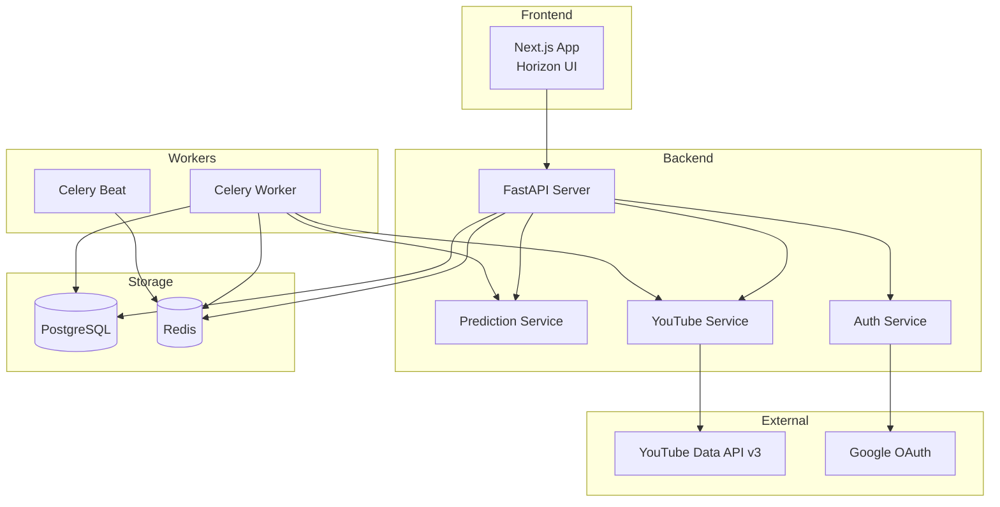
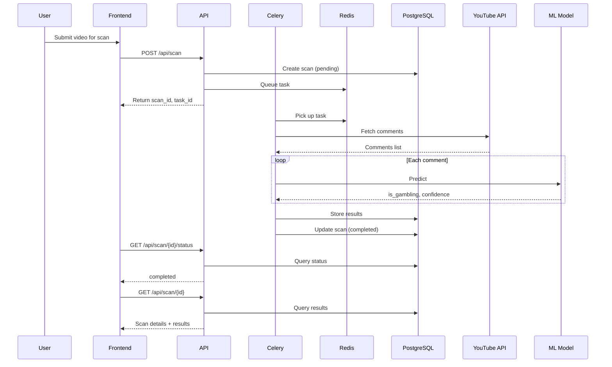

# Design Document: Gambling Comment Detector

## Overview

Gambling Comment Detector is a full-stack application that uses Machine Learning to identify gambling-related spam comments on YouTube videos. The system consists of:

1. **Backend API** (FastAPI): Handles authentication, YouTube API integration, ML predictions, and data persistence
2. **Frontend** (Next.js/Horizon UI): Provides user interface for video browsing, scanning, and comment management
3. **Background Workers** (Celery): Processes async scan tasks and handles rate-limited operations
4. **Infrastructure** (Docker): PostgreSQL for persistence, Redis for caching/queuing

The ML model is a pre-trained scikit-learn pipeline that classifies Indonesian text comments as gambling or clean.

## Architecture



### Request Flow



## Components and Interfaces

### Backend Components

#### 1. Auth Router (`/api/auth`)

```python
# routers/auth.py
from fastapi import APIRouter, Depends, HTTPException
from fastapi.responses import RedirectResponse

router = APIRouter(prefix="/api/auth", tags=["auth"])

@router.get("/google")
async def google_login() -> RedirectResponse:
    """Initiate Google OAuth flow"""
    pass

@router.get("/google/callback")
async def google_callback(code: str, state: str) -> dict:
    """Handle OAuth callback, return JWT"""
    pass

@router.post("/refresh")
async def refresh_token(refresh_token: str) -> dict:
    """Refresh access token"""
    pass

@router.post("/logout")
async def logout(current_user: User = Depends(get_current_user)) -> dict:
    """Revoke tokens and logout"""
    pass

@router.get("/me")
async def get_me(current_user: User = Depends(get_current_user)) -> UserResponse:
    """Get current user info"""
    pass
```

#### 2. Prediction Router (`/api/predict`)

```python
# routers/prediction.py
from fastapi import APIRouter
from schemas.prediction import PredictionRequest, PredictionResponse, BatchPredictionResponse

router = APIRouter(prefix="/api/predict", tags=["prediction"])

@router.post("/", response_model=BatchPredictionResponse)
async def batch_predict(request: PredictionRequest) -> BatchPredictionResponse:
    """Batch predict comments (sync or async)"""
    pass

@router.post("/single", response_model=PredictionResponse)
async def single_predict(text: str) -> PredictionResponse:
    """Single comment prediction"""
    pass

@router.get("/task/{task_id}")
async def get_task_status(task_id: str) -> dict:
    """Get async task status"""
    pass
```

#### 3. Scan Router (`/api/scan`)

```python
# routers/scan.py
from fastapi import APIRouter, Depends
from schemas.scan import ScanCreate, ScanResponse, ScanListResponse

router = APIRouter(prefix="/api/scan", tags=["scan"])

@router.post("/", response_model=ScanResponse)
async def create_scan(
    request: ScanCreate,
    current_user: User = Depends(get_current_user)
) -> ScanResponse:
    """Start video scan (queued)"""
    pass

@router.get("/history", response_model=ScanListResponse)
async def get_history(
    page: int = 1,
    limit: int = 10,
    current_user: User = Depends(get_current_user)
) -> ScanListResponse:
    """Get scan history (paginated)"""
    pass

@router.get("/{scan_id}", response_model=ScanDetailResponse)
async def get_scan(
    scan_id: str,
    current_user: User = Depends(get_current_user)
) -> ScanDetailResponse:
    """Get scan detail + results"""
    pass

@router.get("/{scan_id}/status")
async def get_scan_status(
    scan_id: str,
    current_user: User = Depends(get_current_user)
) -> dict:
    """Get scan status (polling)"""
    pass

@router.delete("/{scan_id}")
async def delete_scan(
    scan_id: str,
    current_user: User = Depends(get_current_user)
) -> dict:
    """Delete scan"""
    pass
```

#### 4. YouTube Router (`/api/youtube`)

```python
# routers/youtube.py
from fastapi import APIRouter, Depends

router = APIRouter(prefix="/api/youtube", tags=["youtube"])

@router.get("/my-videos")
async def get_my_videos(
    page_token: str = None,
    current_user: User = Depends(get_current_user)
) -> dict:
    """Get user's videos"""
    pass

@router.get("/search")
async def search_videos(q: str, page_token: str = None) -> dict:
    """Search public videos"""
    pass

@router.get("/videos/{video_id}")
async def get_video(video_id: str) -> dict:
    """Get video info"""
    pass

@router.get("/videos/{video_id}/comments")
async def get_comments(video_id: str, page_token: str = None) -> dict:
    """Get video comments"""
    pass

@router.delete("/comments/{comment_id}")
async def delete_comment(
    comment_id: str,
    current_user: User = Depends(get_current_user)
) -> dict:
    """Delete single comment"""
    pass

@router.delete("/comments/bulk")
async def delete_comments_bulk(
    comment_ids: list[str],
    current_user: User = Depends(get_current_user)
) -> dict:
    """Delete multiple comments"""
    pass
```

#### 5. Dashboard Router (`/api/dashboard`)

```python
# routers/dashboard.py
from fastapi import APIRouter, Depends

router = APIRouter(prefix="/api/dashboard", tags=["dashboard"])

@router.get("/stats")
async def get_stats(current_user: User = Depends(get_current_user)) -> dict:
    """Get overview statistics"""
    pass

@router.get("/chart-data")
async def get_chart_data(current_user: User = Depends(get_current_user)) -> dict:
    """Get chart data for past 30 days"""
    pass

@router.get("/export/{scan_id}")
async def export_scan(
    scan_id: str,
    format: str = "csv",
    current_user: User = Depends(get_current_user)
) -> Response:
    """Export scan results"""
    pass
```

### Services

#### 1. Auth Service

```python
# services/auth_service.py
class AuthService:
    def __init__(self, db: Session):
        self.db = db
    
    def get_google_auth_url(self, state: str) -> str:
        """Generate Google OAuth URL with scopes"""
        pass
    
    async def exchange_code(self, code: str) -> dict:
        """Exchange auth code for tokens"""
        pass
    
    def create_jwt(self, user: User) -> str:
        """Create JWT token"""
        pass
    
    def verify_jwt(self, token: str) -> dict:
        """Verify and decode JWT"""
        pass
    
    def encrypt_token(self, token: str) -> str:
        """Encrypt OAuth token for storage"""
        pass
    
    def decrypt_token(self, encrypted: str) -> str:
        """Decrypt stored OAuth token"""
        pass
    
    async def refresh_google_token(self, user: User) -> dict:
        """Refresh expired Google token"""
        pass
    
    async def revoke_tokens(self, user: User) -> bool:
        """Revoke Google OAuth tokens"""
        pass
```

#### 2. Prediction Service

```python
# services/prediction_service.py
import joblib
from pathlib import Path

class PredictionService:
    _model = None
    
    @classmethod
    def load_model(cls):
        """Load ML model from joblib file"""
        if cls._model is None:
            model_path = Path(__file__).parent.parent.parent / "ml" / "model_pipeline.joblib"
            if not model_path.exists():
                raise FileNotFoundError(f"Model not found: {model_path}")
            cls._model = joblib.load(model_path)
        return cls._model
    
    def predict_single(self, text: str) -> dict:
        """Predict single comment"""
        model = self.load_model()
        prediction = model.predict([text])[0]
        probabilities = model.predict_proba([text])[0]
        
        return {
            "text": text,
            "is_gambling": bool(prediction),
            "confidence": float(max(probabilities))
        }
    
    def predict_batch(self, texts: list[str]) -> list[dict]:
        """Predict batch of comments"""
        model = self.load_model()
        predictions = model.predict(texts)
        probabilities = model.predict_proba(texts)
        
        results = []
        for text, pred, prob in zip(texts, predictions, probabilities):
            results.append({
                "text": text,
                "is_gambling": bool(pred),
                "confidence": float(max(prob))
            })
        return results
```

#### 3. YouTube Service

```python
# services/youtube_service.py
from googleapiclient.discovery import build
from google.oauth2.credentials import Credentials

class YouTubeService:
    def __init__(self, credentials: Credentials = None, api_key: str = None):
        if credentials:
            self.youtube = build("youtube", "v3", credentials=credentials)
        else:
            self.youtube = build("youtube", "v3", developerKey=api_key)
    
    def get_my_videos(self, page_token: str = None) -> dict:
        """Get authenticated user's videos"""
        pass
    
    def search_videos(self, query: str, page_token: str = None) -> dict:
        """Search public videos"""
        pass
    
    def get_video_details(self, video_id: str) -> dict:
        """Get video metadata"""
        pass
    
    def get_comments(self, video_id: str, page_token: str = None) -> dict:
        """Get video comments with pagination"""
        pass
    
    def get_all_comments(self, video_id: str) -> list[dict]:
        """Fetch all comments (handles pagination)"""
        pass
    
    def delete_comment(self, comment_id: str) -> bool:
        """Delete a single comment"""
        pass
    
    def delete_comments_bulk(self, comment_ids: list[str]) -> dict:
        """Delete multiple comments with rate limiting"""
        pass
```

#### 4. Export Service

```python
# services/export_service.py
import csv
import json
from io import StringIO

class ExportService:
    def export_csv(self, scan: Scan, results: list[ScanResult]) -> str:
        """Export scan results as CSV"""
        pass
    
    def export_json(self, scan: Scan, results: list[ScanResult]) -> str:
        """Export scan results as JSON"""
        pass
```

### Celery Workers

```python
# workers/tasks.py
from celery import shared_task
from services.prediction_service import PredictionService
from services.youtube_service import YouTubeService

@shared_task(bind=True, max_retries=3)
def scan_video_comments(self, scan_id: str, video_id: str, user_id: str):
    """
    Async task to scan video comments
    1. Fetch all comments from YouTube
    2. Run ML prediction on each
    3. Store results in database
    4. Update scan status
    """
    pass

@shared_task(bind=True, max_retries=3)
def batch_predict(self, texts: list[str]) -> list[dict]:
    """Async batch prediction task"""
    pass

@shared_task
def cleanup_old_results():
    """Periodic task to clean up old scan results"""
    pass
```

## Data Models

### SQLAlchemy Models

```python
# models/user.py
from sqlalchemy import Column, String, DateTime, Text
from sqlalchemy.dialects.postgresql import UUID
from sqlalchemy.orm import relationship
import uuid

class User(Base):
    __tablename__ = "users"
    
    id = Column(UUID(as_uuid=True), primary_key=True, default=uuid.uuid4)
    google_id = Column(String(255), unique=True, nullable=False, index=True)
    email = Column(String(255), nullable=False)
    name = Column(String(255))
    avatar_url = Column(String(500))
    access_token = Column(Text)  # Encrypted
    refresh_token = Column(Text)  # Encrypted
    token_expires = Column(DateTime)
    created_at = Column(DateTime, default=datetime.utcnow)
    updated_at = Column(DateTime, default=datetime.utcnow, onupdate=datetime.utcnow)
    
    scans = relationship("Scan", back_populates="user", cascade="all, delete-orphan")
```

```python
# models/scan.py
from sqlalchemy import Column, String, Integer, DateTime, Text, ForeignKey, Float, Boolean
from sqlalchemy.dialects.postgresql import UUID
from sqlalchemy.orm import relationship
import uuid

class Scan(Base):
    __tablename__ = "scans"
    
    id = Column(UUID(as_uuid=True), primary_key=True, default=uuid.uuid4)
    user_id = Column(UUID(as_uuid=True), ForeignKey("users.id", ondelete="CASCADE"), nullable=False)
    video_id = Column(String(50), nullable=False, index=True)
    video_title = Column(String(500))
    video_thumbnail = Column(String(500))
    channel_name = Column(String(255))
    total_comments = Column(Integer, default=0)
    gambling_count = Column(Integer, default=0)
    clean_count = Column(Integer, default=0)
    status = Column(String(20), default="pending", index=True)  # pending/processing/completed/failed
    error_message = Column(Text)
    task_id = Column(String(255))
    scanned_at = Column(DateTime)
    created_at = Column(DateTime, default=datetime.utcnow)
    
    user = relationship("User", back_populates="scans")
    results = relationship("ScanResult", back_populates="scan", cascade="all, delete-orphan")


class ScanResult(Base):
    __tablename__ = "scan_results"
    
    id = Column(UUID(as_uuid=True), primary_key=True, default=uuid.uuid4)
    scan_id = Column(UUID(as_uuid=True), ForeignKey("scans.id", ondelete="CASCADE"), nullable=False)
    comment_id = Column(String(255), nullable=False)
    comment_text = Column(Text)
    author_name = Column(String(255))
    author_avatar = Column(String(500))
    is_gambling = Column(Boolean, nullable=False)
    confidence = Column(Float, nullable=False)
    created_at = Column(DateTime, default=datetime.utcnow)
    
    scan = relationship("Scan", back_populates="results")
```

### Pydantic Schemas

```python
# schemas/user.py
from pydantic import BaseModel, EmailStr
from datetime import datetime
from uuid import UUID

class UserBase(BaseModel):
    email: EmailStr
    name: str | None = None
    avatar_url: str | None = None

class UserResponse(UserBase):
    id: UUID
    google_id: str
    created_at: datetime
    
    class Config:
        from_attributes = True

class TokenResponse(BaseModel):
    access_token: str
    token_type: str = "bearer"
    expires_in: int
    user: UserResponse
```

```python
# schemas/scan.py
from pydantic import BaseModel
from datetime import datetime
from uuid import UUID

class ScanCreate(BaseModel):
    video_id: str
    video_url: str | None = None

class ScanResponse(BaseModel):
    id: UUID
    video_id: str
    video_title: str | None
    status: str
    task_id: str | None
    created_at: datetime
    
    class Config:
        from_attributes = True

class ScanResultResponse(BaseModel):
    id: UUID
    comment_id: str
    comment_text: str
    author_name: str | None
    is_gambling: bool
    confidence: float
    
    class Config:
        from_attributes = True

class ScanDetailResponse(ScanResponse):
    video_thumbnail: str | None
    channel_name: str | None
    total_comments: int
    gambling_count: int
    clean_count: int
    scanned_at: datetime | None
    results: list[ScanResultResponse] = []

class ScanListResponse(BaseModel):
    items: list[ScanResponse]
    total: int
    page: int
    limit: int
    pages: int
```

```python
# schemas/prediction.py
from pydantic import BaseModel, Field

class PredictionRequest(BaseModel):
    texts: list[str] = Field(..., min_length=1, max_length=1000)
    async_mode: bool = False

class PredictionResponse(BaseModel):
    text: str
    is_gambling: bool
    confidence: float = Field(..., ge=0.0, le=1.0)

class BatchPredictionResponse(BaseModel):
    predictions: list[PredictionResponse]
    task_id: str | None = None
```

```python
# schemas/youtube.py
from pydantic import BaseModel
from datetime import datetime

class VideoInfo(BaseModel):
    id: str
    title: str
    description: str | None
    thumbnail_url: str
    channel_name: str
    channel_id: str
    view_count: int
    comment_count: int
    published_at: datetime

class CommentInfo(BaseModel):
    id: str
    text: str
    author_name: str
    author_avatar: str | None
    author_channel_id: str | None
    like_count: int
    published_at: datetime

class VideoListResponse(BaseModel):
    items: list[VideoInfo]
    next_page_token: str | None
    total_results: int

class CommentListResponse(BaseModel):
    items: list[CommentInfo]
    next_page_token: str | None
    total_results: int
```


## Correctness Properties

*A property is a characteristic or behavior that should hold true across all valid executions of a system-essentially, a formal statement about what the system should do. Properties serve as the bridge between human-readable specifications and machine-verifiable correctness guarantees.*

Based on the acceptance criteria analysis, the following correctness properties must be validated through property-based testing:

### Property 1: JWT Round-Trip Consistency

*For any* valid user data, creating a JWT token and then decoding it SHALL produce equivalent user information (id, email, google_id).

**Validates: Requirements 1.4**

### Property 2: Token Encryption Round-Trip

*For any* OAuth token string, encrypting and then decrypting the token SHALL produce the original token value.

**Validates: Requirements 1.3, 10.1, 11.3**

### Property 3: Prediction Output Format and Bounds

*For any* list of text strings (1 to 1000 items), the prediction service SHALL return a list of equal length where each prediction contains is_gambling (boolean) and confidence (float between 0.0 and 1.0 inclusive).

**Validates: Requirements 2.2, 2.3, 2.4**

### Property 4: Prediction Serialization Round-Trip

*For any* PredictionResponse object, serializing to JSON and deserializing back SHALL produce an equivalent object with identical field values.

**Validates: Requirements 2.6**

### Property 5: Scan Creation Status Invariant

*For any* valid video ID submitted for scanning, the created scan record SHALL have status "pending" and a non-null task_id.

**Validates: Requirements 3.1, 9.1**

### Property 6: Scan Results Foreign Key Integrity

*For any* scan result stored in the database, the scan_id foreign key SHALL reference an existing scan record.

**Validates: Requirements 3.4, 10.2**

### Property 7: Scan Completion Counts Consistency

*For any* completed scan, the sum of gambling_count and clean_count SHALL equal total_comments, and these counts SHALL match the actual count of results in scan_results table.

**Validates: Requirements 3.5**

### Property 8: Video Response Required Fields

*For any* video returned from my-videos or search endpoints, the response SHALL contain non-null values for id, title, thumbnail_url, and channel_name.

**Validates: Requirements 4.2, 5.2**

### Property 9: Bulk Deletion Sequential Processing

*For any* list of comment IDs submitted for bulk deletion, the system SHALL process them sequentially with minimum delay between API calls.

**Validates: Requirements 6.2, 12.4**

### Property 10: Dashboard Stats Calculation

*For any* user with scan history, the total_scans count SHALL equal the number of scan records, and gambling_detection_rate SHALL equal (total gambling comments / total comments analyzed).

**Validates: Requirements 7.1**

### Property 11: Chart Data Date Range

*For any* chart data request, the response SHALL contain data points for each of the past 30 days with scan counts aggregated by date.

**Validates: Requirements 7.2**

### Property 12: Scan History Pagination

*For any* pagination request with page and limit parameters, the response SHALL return at most `limit` items, correct total count, and valid page metadata.

**Validates: Requirements 7.3**

### Property 13: Export Completeness and Round-Trip

*For any* scan with results, the CSV export SHALL contain all scan_results with columns (comment_id, text, author, is_gambling, confidence) plus metadata, and the JSON export SHALL be parseable back to equivalent data structures.

**Validates: Requirements 8.1, 8.2, 8.3, 8.4**

### Property 14: Cascade Delete Integrity

*For any* user deletion, all associated scans and scan_results SHALL be deleted (no orphan records remain).

**Validates: Requirements 10.3**

### Property 15: UTC Timestamp Consistency

*For any* timestamp stored in the database (created_at, updated_at, scanned_at), the timezone SHALL be UTC.

**Validates: Requirements 10.5**

### Property 16: Authentication Enforcement

*For any* protected endpoint, requests without valid JWT or with expired JWT SHALL receive 401 status response.

**Validates: Requirements 11.1, 11.2**

### Property 17: Input Validation Enforcement

*For any* request with invalid or malformed data according to Pydantic schemas, the system SHALL return 422 status with validation error details.

**Validates: Requirements 11.4, 11.5**

## Error Handling

### HTTP Error Responses

| Status Code | Error Type | Description |
|-------------|------------|-------------|
| 400 | Bad Request | Invalid request parameters |
| 401 | Unauthorized | Missing or invalid JWT token |
| 403 | Forbidden | User lacks permission for action |
| 404 | Not Found | Resource does not exist |
| 422 | Validation Error | Request body validation failed |
| 429 | Too Many Requests | Rate limit exceeded |
| 500 | Internal Server Error | Unexpected server error |

### Error Response Schema

```python
class ErrorResponse(BaseModel):
    error: str
    error_code: str
    message: str
    details: dict | None = None
```

### YouTube API Error Handling

```python
class YouTubeAPIError(Exception):
    def __init__(self, status_code: int, message: str, reason: str):
        self.status_code = status_code
        self.message = message
        self.reason = reason

# Common YouTube API errors:
# - 403 forbidden: User doesn't own the comment/video
# - 404 notFound: Comment/video doesn't exist
# - 403 quotaExceeded: API quota exceeded
# - 400 invalidVideoId: Invalid video ID format
```

### Celery Task Error Handling

```python
@shared_task(bind=True, max_retries=3, default_retry_delay=60)
def scan_video_comments(self, scan_id: str, video_id: str, user_id: str):
    try:
        # ... task logic
    except YouTubeAPIError as e:
        if e.reason == "quotaExceeded":
            raise self.retry(countdown=300)  # Retry after 5 minutes
        else:
            # Update scan status to failed
            update_scan_status(scan_id, "failed", str(e))
    except Exception as e:
        raise self.retry(exc=e, countdown=60 * (2 ** self.request.retries))
```

## Testing Strategy

### Dual Testing Approach

This project uses both unit tests and property-based tests for comprehensive coverage:

1. **Unit Tests**: Verify specific examples, edge cases, and integration points
2. **Property-Based Tests**: Verify universal properties that should hold across all valid inputs

### Testing Framework

- **Unit Testing**: pytest 8.3.4 with pytest-asyncio 0.24.0
- **Property-Based Testing**: Hypothesis (latest version compatible with Python 3.12)

### Property-Based Testing Configuration

```python
# conftest.py
from hypothesis import settings, Verbosity

settings.register_profile("ci", max_examples=100, deadline=None)
settings.register_profile("dev", max_examples=50, deadline=None)
settings.register_profile("debug", max_examples=10, verbosity=Verbosity.verbose)
```

Each property-based test MUST:
1. Run a minimum of 100 iterations
2. Be tagged with the correctness property it implements using format: `**Feature: gambling-comment-detector, Property {number}: {property_text}**`
3. Reference the requirements clause it validates

### Test Structure

```
backend/tests/
├── conftest.py              # Shared fixtures
├── unit/
│   ├── test_auth_service.py
│   ├── test_prediction_service.py
│   ├── test_youtube_service.py
│   └── test_export_service.py
├── properties/
│   ├── test_jwt_properties.py
│   ├── test_prediction_properties.py
│   ├── test_scan_properties.py
│   ├── test_export_properties.py
│   └── test_validation_properties.py
└── integration/
    ├── test_auth_flow.py
    ├── test_scan_flow.py
    └── test_youtube_integration.py
```

### Example Property Test

```python
# tests/properties/test_jwt_properties.py
from hypothesis import given, strategies as st, settings

class TestJWTProperties:
    """
    **Feature: gambling-comment-detector, Property 1: JWT Round-Trip Consistency**
    **Validates: Requirements 1.4**
    """
    
    @given(
        user_id=st.uuids(),
        email=st.emails(),
        google_id=st.text(min_size=10, max_size=50, alphabet=st.characters(whitelist_categories=('Nd', 'Lu', 'Ll')))
    )
    @settings(max_examples=100)
    def test_jwt_roundtrip(self, user_id, email, google_id):
        """JWT encode then decode produces equivalent user data"""
        auth_service = AuthService()
        
        # Create mock user
        user_data = {"id": str(user_id), "email": email, "google_id": google_id}
        
        # Encode
        token = auth_service.create_jwt(user_data)
        
        # Decode
        decoded = auth_service.verify_jwt(token)
        
        # Assert round-trip
        assert decoded["id"] == str(user_id)
        assert decoded["email"] == email
        assert decoded["google_id"] == google_id
```

### Example Unit Test

```python
# tests/unit/test_prediction_service.py
import pytest
from services.prediction_service import PredictionService

class TestPredictionService:
    def test_model_loads_successfully(self):
        """Model file loads without error"""
        service = PredictionService()
        model = service.load_model()
        assert model is not None
    
    def test_single_prediction_gambling_comment(self):
        """Known gambling comment is detected"""
        service = PredictionService()
        result = service.predict_single("Slot gacor hari ini maxwin 100jt")
        assert result["is_gambling"] is True
        assert 0.0 <= result["confidence"] <= 1.0
    
    def test_single_prediction_clean_comment(self):
        """Normal comment is not flagged"""
        service = PredictionService()
        result = service.predict_single("Video yang sangat informatif, terima kasih!")
        assert result["is_gambling"] is False
```
