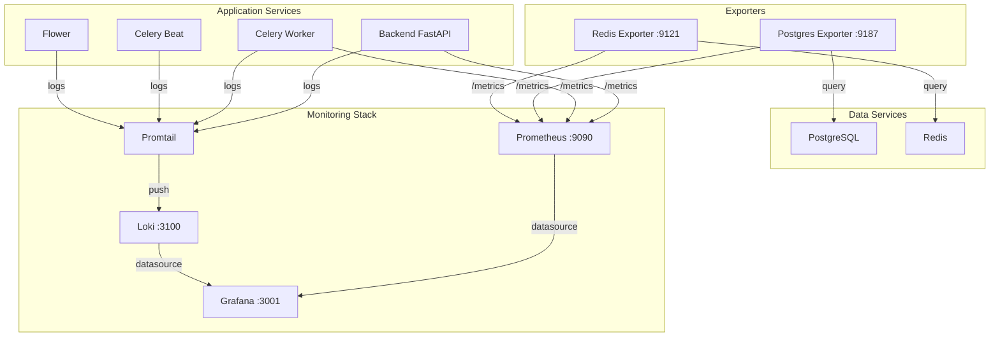

# Design Document: Monitoring and Observability

## Overview

This design document outlines the architecture and implementation for adding comprehensive monitoring and observability to the Gambling Comment Detector application. The solution integrates Prometheus for metrics collection, Grafana for visualization, Loki for log aggregation, and dedicated exporters for PostgreSQL and Redis monitoring.

The monitoring stack will be fully containerized and integrated into the existing docker-compose.yml, enabling single-command deployment of the entire application with observability capabilities.

## Architecture



## Components and Interfaces

### 1. Prometheus (Metrics Collection)

**Purpose**: Central metrics collection and storage

**Configuration**:
- Port: 9090 (configurable via PROMETHEUS_PORT)
- Scrape interval: 15s
- Retention: 15 days

**Scrape Targets**:
| Target | Endpoint | Port |
|--------|----------|------|
| Backend | /metrics | 8000 |
| Postgres Exporter | /metrics | 9187 |
| Redis Exporter | /metrics | 9121 |

**File**: `monitoring/prometheus/prometheus.yml`

### 2. Grafana (Visualization)

**Purpose**: Dashboard visualization and alerting UI

**Configuration**:
- Port: 3001 (configurable via GRAFANA_PORT)
- Admin credentials: configurable via environment
- Anonymous access: disabled

**Provisioned Resources**:
- Datasources: Prometheus, Loki
- Dashboards: Backend API, Infrastructure, Celery

**Files**:
- `monitoring/grafana/provisioning/datasources/datasources.yml`
- `monitoring/grafana/provisioning/dashboards/dashboards.yml`
- `monitoring/grafana/dashboards/*.json`

### 3. Loki (Log Aggregation)

**Purpose**: Centralized log storage and querying

**Configuration**:
- Port: 3100
- Storage: Local filesystem with retention
- Index: BoltDB shipper

**File**: `monitoring/loki/loki-config.yml`

### 4. Promtail (Log Collector)

**Purpose**: Collect and forward container logs to Loki

**Configuration**:
- Scrape Docker container logs
- Add labels: container_name, service_name
- Parse JSON logs from backend

**File**: `monitoring/promtail/promtail-config.yml`

### 5. Postgres Exporter

**Purpose**: Expose PostgreSQL metrics in Prometheus format

**Metrics Exposed**:
- `pg_stat_activity_count` - Active connections
- `pg_stat_database_tup_*` - Tuple operations
- `pg_database_size_bytes` - Database size

### 6. Redis Exporter

**Purpose**: Expose Redis metrics in Prometheus format

**Metrics Exposed**:
- `redis_memory_used_bytes` - Memory usage
- `redis_connected_clients` - Client connections
- `redis_commands_total` - Command statistics

### 7. FastAPI Metrics Middleware

**Purpose**: Instrument FastAPI application with Prometheus metrics

**Implementation**: Use `prometheus-fastapi-instrumentator` library

**Metrics Exposed**:
- `http_requests_total` - Request counter with labels (method, path, status)
- `http_request_duration_seconds` - Request latency histogram
- `http_requests_in_progress` - Active request gauge

**File**: `backend/app/metrics.py`

## Data Models

### Prometheus Metrics Format

```
# HELP http_requests_total Total HTTP requests
# TYPE http_requests_total counter
http_requests_total{method="GET",path="/api/health",status="200"} 1234

# HELP http_request_duration_seconds HTTP request latency
# TYPE http_request_duration_seconds histogram
http_request_duration_seconds_bucket{method="GET",path="/api/health",le="0.1"} 1000
http_request_duration_seconds_bucket{method="GET",path="/api/health",le="0.5"} 1200
http_request_duration_seconds_sum{method="GET",path="/api/health"} 45.67
http_request_duration_seconds_count{method="GET",path="/api/health"} 1234
```

### Structured Log Format (JSON)

```json
{
  "timestamp": "2024-01-15T10:30:00.000Z",
  "level": "INFO",
  "request_id": "uuid-string",
  "method": "GET",
  "path": "/api/health",
  "status_code": 200,
  "duration_ms": 15.5,
  "client_ip": "192.168.1.1",
  "message": "Request completed"
}
```

## Correctness Properties

*A property is a characteristic or behavior that should hold true across all valid executions of a system-essentially, a formal statement about what the system should do. Properties serve as the bridge between human-readable specifications and machine-verifiable correctness guarantees.*

### Property 1: Request Metrics Recording

*For any* HTTP request to the Backend_Service with any valid path and method, the metrics endpoint SHALL return updated counters that include labels matching the request's path and method.

**Validates: Requirements 2.2, 2.3**

### Property 2: Structured Log Completeness

*For any* HTTP request processed by Backend_Service, the emitted log entry SHALL be valid JSON containing at minimum: timestamp, request_id, method, path, and status_code fields.

**Validates: Requirements 4.4**

### Property 3: Log Forwarding with Labels

*For any* log entry written by a containerized service, when queried from Loki, the entry SHALL include labels identifying the source service name and container.

**Validates: Requirements 4.2**

## Error Handling

### Prometheus Scrape Failures
- Prometheus marks target as DOWN after 3 consecutive failures
- Grafana dashboards show "No Data" for affected metrics
- Alert rules can trigger on `up == 0` condition

### Loki Ingestion Failures
- Promtail buffers logs locally during Loki unavailability
- Logs are retried with exponential backoff
- Buffer size configurable to prevent memory exhaustion

### Exporter Connection Failures
- Postgres/Redis exporters return error metrics when database unavailable
- Prometheus records scrape errors in `scrape_duration_seconds` and `scrape_samples_scraped`

### Grafana Datasource Failures
- Dashboards display error messages for unavailable datasources
- Health check endpoint reports datasource status

## Testing Strategy

### Dual Testing Approach

This feature requires both unit tests and integration tests due to its infrastructure-heavy nature.

**Property-Based Testing Library**: `hypothesis` (Python)

### Unit Tests

1. **Metrics Middleware Tests**
   - Verify metrics are recorded for requests
   - Verify correct labels are applied
   - Verify histogram buckets are populated

2. **Structured Logging Tests**
   - Verify log output is valid JSON
   - Verify required fields are present
   - Verify timestamp format is ISO 8601

### Integration Tests

1. **Prometheus Integration**
   - Verify /metrics endpoint returns valid Prometheus format
   - Verify all expected metrics are present

2. **Docker Compose Stack**
   - Verify all services start successfully
   - Verify network connectivity between services
   - Verify Grafana can query Prometheus and Loki

### Property-Based Tests

Property tests will use Hypothesis to generate random HTTP requests and verify:
- Metrics are always recorded with correct labels
- Logs are always valid JSON with required fields

**Test Configuration**: Minimum 100 iterations per property test

**Test Annotation Format**: `**Feature: monitoring-observability, Property {number}: {property_text}**`
